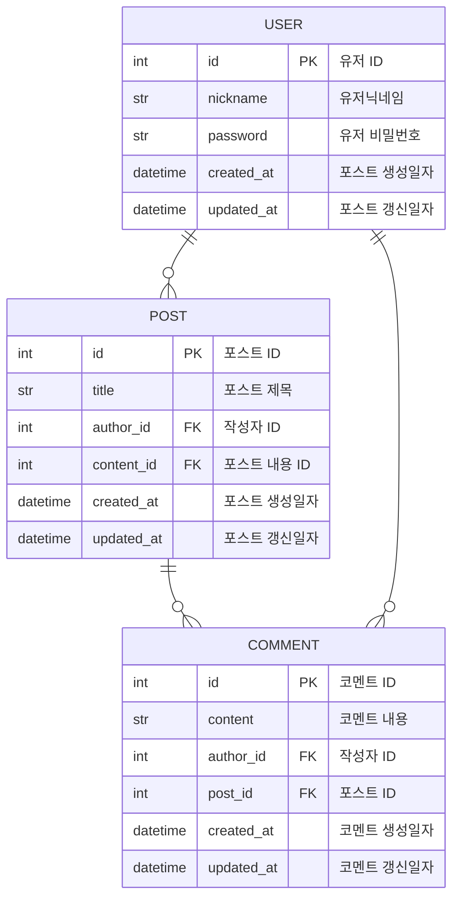

# FastApi-Post

## Introduce
간단한 게시판 작성 프로젝트입니다.

## Pre-Require
* Python 3.11.9
* poetry

## Installation
가상환경 설정
```
poetry install
```

가상환경 실행
```
poetry shell
```

## Docker
* 앱 이미지 생성
```
docker build --tag fastapi-post:1.0 .
```
* docker-compose 실행
```
docker-compose up
```
* docker-compose 종료
```
docker-compose down
```
## Start
서버 실행
* Dev
```
uvicorn main:app --reload
```
* Prod
```
uvicorn main:app
```

## API
API 예시
* 포스트 생성
```
curl -X POST http://localhost:8000/posts \
     -H "Content-Type: application/json" \
     -d '{"title": "제목", "content": "내용"}'
```
* 전체 포스트 리스트
```
curl -X GET "http://localhost:8000/posts?page=1"
```
* post_id 포스트
```
curl -X GET http://localhost:8000/posts/1
```
* 로그인
```
curl -X POST http://localhost:8000/users/login \
     -H "Content-Type: application/json" \
     -d '{"username": "사용자이름", "password": "비밀번호"}'
```

* API 상세
```
http://localhost:8000/docs
```

## ERD
* mermaid.js


## TEST
### E2E Test
* E2E Test start
```
pytest tests/e2e
```
* Unit Test
```
pytest tests/unit
```
### Test Coverage
```

Name                            Stmts   Miss  Cover
---------------------------------------------------
main.py                            12      1    92%
src\API\comment.py                 49     20    59%
src\API\post.py                    58     26    55%
src\API\user.py                    31     14    55%
src\auth.py                        31      1    97%
src\database.py                    18      0   100%
src\domain\comment.py              13      0   100%
src\domain\post.py                 31      0   100%
src\domain\user.py                 15      0   100%
src\schemas\comment.py             23      0   100%
src\schemas\post.py                23      0   100%
src\schemas\user.py                22      0   100%
src\service\comment.py             38      8    79%
src\service\post.py                47     16    66%
src\service\user.py                20      4    80%
tests\e2e\test_comment_e2e.py     109      0   100%
tests\e2e\test_post_e2e.py        107      0   100%
tests\e2e\test_user_e2e.py         65      0   100%
---------------------------------------------------
TOTAL                             712     90    87%
```

## Locust
```
locust -f locust-test\stress_test.py
```
* workers = 1 부하테스트 결과
```
locust-test\report_worker_1.html
```
* workers = 5 부하테스트 결과
```
locust-test\report_worker_5.html
```