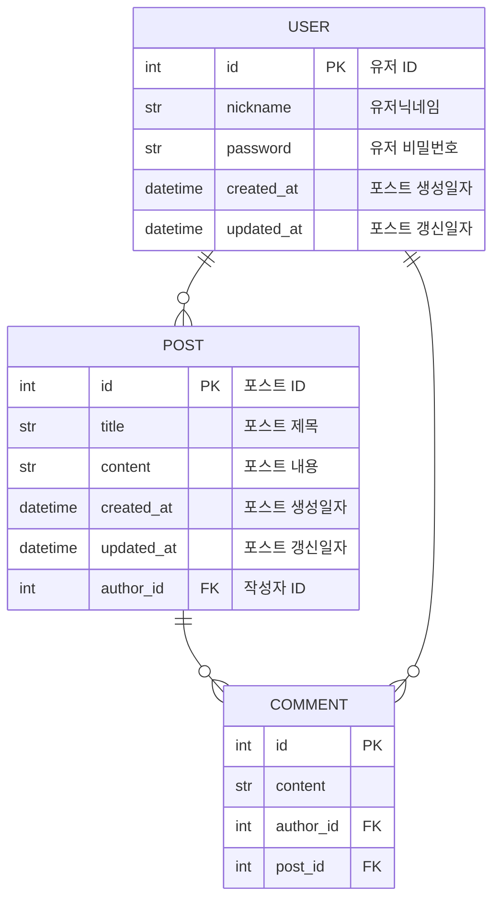

# FastApi-Post

## Introduce
간단한 게시판 작성 프로젝트입니다.

## Pre-Require
* Python 3.11.9
* poetry

## Installation
가상환경 설정
```
poetry install
```

가상환경 실행
```
poetry shell
```
## Start
서버 실행
```
Dev: uvicorn main:app --reload
Prod: uvicorn main:app
```

## API
API 예시
```
POST /posts - 포스트 생성
GET /posts?page=1 - 전체 포스트 리스트
GET /posts/{post_id} - post_id 포스트

POST /users/login - 로그인
```

API 상세
```
http://localhost:8000/docs
```

## ERD
* mermaid.js
